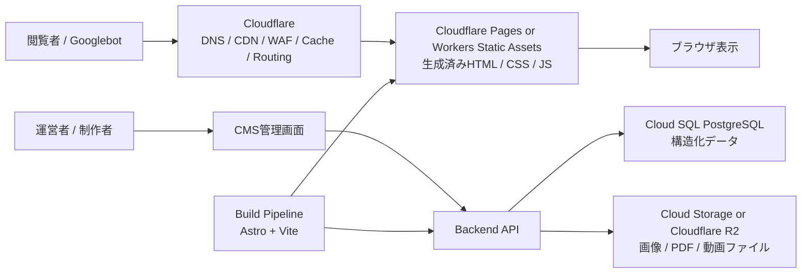
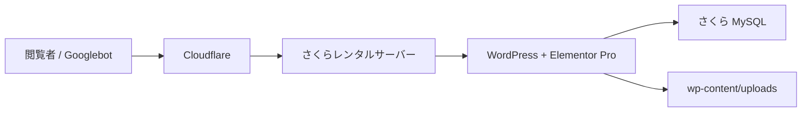
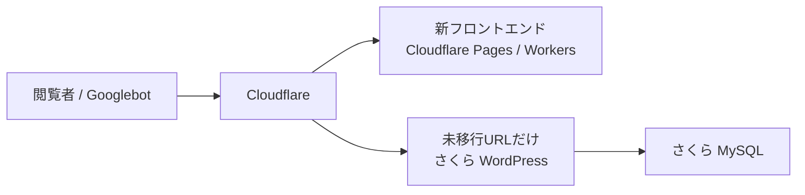
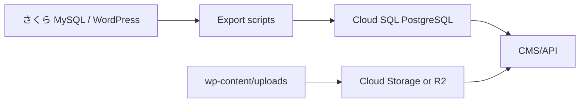
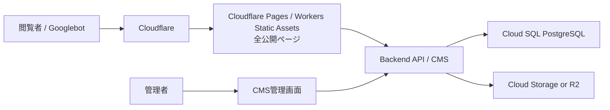

# Lexus EC target architecture proposal

作成日: 2026-06-19

## 結論

最適案は、いきなりWordPressを捨てる構成ではなく、次の三段階で進めること。

1. 現行安定化: `Cloudflare -> さくら WordPress`
2. 段階移行: `Cloudflare -> 新フロントエンド`、未移行URLだけ `さくら WordPress`
3. 最終形: `Cloudflare -> 新フロントエンド -> API/CMS -> DB + Object Storage`

ここでいう「新フロントエンド」は、Cloudflareとは別概念。Cloudflareは入口、DNS、CDN、WAF、キャッシュ、ルーティング。新フロントエンドは、実際のページを構成するHTML/CSS/JavaScript。

## 最終アーキテクチャ



## レイヤーごとの役割

### Cloudflare

Cloudflareは「サイトの入口」。HTML/CSS/JSそのものではない。

担当:

- DNS
- HTTPS終端
- CDNキャッシュ
- WAF
- Bot対策
- リダイレクト
- 旧WordPressと新フロントエンドの振り分け
- 将来的にはCloudflare Pages/Workersによる静的ファイル配信

つまり、Cloudflareは「交通整理と配信網」。

### 新フロントエンド

新フロントエンドは「ページそのもの」。

担当:

- HTML生成
- CSS設計
- JavaScript最小化
- 画像の表示
- SEOタグ出力
- schema.org構造化データ出力
- sitemap生成

技術候補:

- Astro: コンテンツ中心サイト向き。不要なJavaScriptを出しにくい。
- Vite: ローカル開発サーバーと本番ビルドの道具。Astro内部でも使われる。

運用イメージ:

```text
C:\---hp
  src/
    pages/
    components/
    layouts/
    styles/
    content/
  public/
  dist/
```

ローカルでは:

```powershell
npm run dev
```

で `http://localhost:5173` のようなURLを開き、ブラウザで確認しながら作る。

本番化すると:

```powershell
npm run build
```

で `dist/` に軽いHTML/CSS/JSが出る。これをCloudflare PagesやWorkers Static Assetsにデプロイする。

### Backend API

バックエンドは「編集・保存・検索・予約・問い合わせなど、毎回処理が必要な部分」。

担当:

- CMS管理画面へのログイン
- 記事/大学情報/合格者インタビューの保存
- 画像アップロード
- 検索API
- フォーム連携
- sitemap再生成トリガー
- ビルド再実行トリガー

技術候補:

- Cloud Run + Node.js/TypeScript API
- Directus or StrapiをCloud Runに載せる
- 既存WordPressを一時的にHeadless CMSとして使う

おすすめは、最終的には `Cloud Run + CMS/API`。さくらのPHP実行環境からは離れる。

### Database

DBは持つ。ここは前提。

DBに入れるもの:

- ページ本文
- 大学情報
- コース情報
- 合格者インタビュー情報
- 動画メタデータ
- 講師情報
- CTA文言
- SEO title
- meta description
- canonical
- schema用データ
- カテゴリ/タグ
- 公開状態
- 更新日時

推奨:

- Cloud SQL PostgreSQL

理由:

- 構造化データに向いている
- リレーションを扱いやすい
- バックアップ/メンテナンス/高可用性をGoogle側に任せやすい
- 将来、管理画面や検索APIを作りやすい

Google Cloud StorageはDBではない。画像や動画などのファイル置き場。

### Object Storage

画像、PDF、動画ファイルはDBに入れない。Object Storageに置く。

候補:

- Google Cloud Storage
- Cloudflare R2

保存するもの:

- 合格者インタビューのサムネイル
- 講師写真
- 校舎/寮の写真
- PDF資料
- 直接ホストする動画ファイル
- 生成済み画像

動画について:

- YouTube埋め込みを続けるなら、DBにはYouTube URL、videoId、タイトル、説明、サムネイルURLを保存する。
- 自前配信するなら、動画ファイルはCloud Storage/R2/Cloudflare Stream等に置く。DBにはメタデータだけを保存する。

## 途中段階 1: 安定化



この段階では、WordPressもDBもさくらも残す。

やること:

- Cloudflare DNSへ切り替え
- HTTPS/HTTP3/Brotli/WAF設定
- `/wp-admin`, `/wp-login.php`, preview, logged-in cookieはキャッシュ除外
- 静的アセットは長期キャッシュ
- HTMLは短めTTLから開始

目的:

- リスク最小で速度改善
- DNS/Cloudflare運用に慣れる
- SEOタグやURLに一切手を入れない

## 途中段階 2: 主要ページだけ新フロントエンド



この段階が一番重要。

CloudflareがURLごとに振り分ける。

例:

```text
/                         -> 新フロントエンド
/request-documents/       -> 新フロントエンド
/online-guidance/         -> 新フロントエンド
/top/contact/             -> 新フロントエンド
/top/teacher/             -> 新フロントエンド
/lexus-premier/           -> 新フロントエンド
/information-xxxx/        -> まだWordPress
/2026-xxxx/               -> まだWordPress
```

メリット:

- URLは変えない
- 重要ページから高速化できる
- WordPressを一気に壊さない
- SEOの変化をページ単位で監視できる

ローカル制作:

```text
Codex / エディタで修正
↓
npm run dev
↓
localhostで確認
↓
npm run build
↓
CloudflareのプレビューURLで確認
↓
本番反映
```

## 途中段階 3: データ移行



やること:

- WordPress本文をHTML/Markdown/structured blocksへ変換
- AIOSEOのtitle/meta/canonical/schema情報を抽出
- カテゴリ/タグ/slug/公開日/更新日を抽出
- 画像URLを対応表で管理
- 動画URL/サムネイル/説明文をDB化
- 旧URLと新URLが完全一致することを検査

この段階では、WordPressはまだ読める状態で残す。新DBが正しいと確認できたページから、新フロントエンド生成に切り替える。

## 最終段階



この時点で、公開ページ表示にWordPressは関与しない。

WordPressの扱い:

- 完全停止
- しばらく読み取り専用で保管
- 管理用サブドメインに隔離

どれでもよいが、公開サイトのリクエストはWordPressに行かない。

## 推奨する最終技術セット

現時点の推薦:

- DNS/CDN/WAF: Cloudflare
- フロントエンド配信: Cloudflare Pages または Workers Static Assets
- フロントエンド開発: Astro + Vite
- CMS/API: Cloud Run上のDirectus/Strapi、または独自Node.js API
- DB: Cloud SQL PostgreSQL
- 画像/PDF/動画ファイル: Google Cloud Storage
- YouTube動画: 自前保存せず、DBにvideoIdとメタデータを保存
- 既存さくら: 移行完了までWordPress互換originとして残す

Cloudflare R2ではなくGoogle Cloud Storageを第一候補にする理由:

- DBにCloud SQLを使うなら、同じGoogle Cloud内で管理しやすい
- Cloud Run/APIから扱いやすい
- 将来的なバックアップ、権限、監査、データ移行をまとめやすい

ただし、配信コストやCloudflare内完結を重視するならR2も候補。

## SEOを守るための固定ルール

- ドメインを変えない
- URLを変えない
- trailing slashを変えない
- canonicalを変えない
- title/meta descriptionを移植する
- AIOSEO由来のschemaを移植する
- sitemapのURL集合を維持する
- 既存の画像URLは当面維持、後で段階移行
- WordPressから新フロントエンドへ切り替えるページは、公開前後でHTML差分を検査する
- 404/301/200のステータスを監査する

## この構成で何が変わるか

現在:

```text
閲覧のたびに WordPress + Elementor + MySQL がHTMLを作る
```

最終:

```text
普段の閲覧は生成済みHTMLを返す
編集時だけCMS/API/DBを使う
```

つまり、DBは消えない。DBは「編集と生成のため」に残る。閲覧者に毎回DBを触らせない。

これが今回の性能改善の中心。

## 参考

- Cloudflare Pages: https://developers.cloudflare.com/pages/
- Cloudflare Workers Static Assets: https://developers.cloudflare.com/workers/
- Cloudflare R2: https://developers.cloudflare.com/r2/
- Google Cloud Storage: https://docs.cloud.google.com/storage/docs/introduction
- Google Cloud SQL: https://docs.cloud.google.com/sql/docs/introduction
- Vite: https://vite.dev/guide/
- Astro: https://astro.build/
